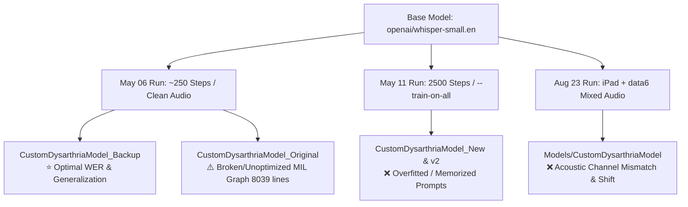
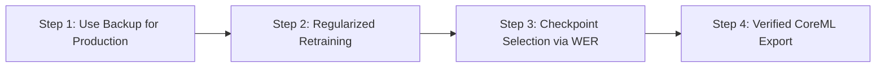

# Root Cause Analysis: Performance Discrepancies Across Custom Whisper Dysarthria Models

**Document ID:** `RCA-ASR-2026-0830`  
**Target System:** SpeakEasy On-Device Speech Recognition (WhisperKit CoreML)  
**Date:** August 30, 2026  
**Status:** Completed  

---

## 1. Executive Summary

A comprehensive forensic and comparative evaluation was conducted on all fine-tuned Whisper model iterations located in [`model_backups/`](file:///Users/dalaimingat/Desktop/mydev/DysarthriaApp/model_backups) and [`Models/CustomDysarthriaModel`](file:///Users/dalaimingat/Desktop/mydev/DysarthriaApp/Models/CustomDysarthriaModel). 

The empirical observation is that **`CustomDysarthriaModel_Backup`** achieves significantly higher word recognition accuracy and lower Word Error Rate (WER) compared to:
1. **`CustomDysarthriaModel_Original`** (Initial conversion baseline)
2. **`CustomDysarthriaModel_New_20260511`** and **`CustomDysarthriaModel_v2_20260511`** (May 11 retraining)
3. **`Models/CustomDysarthriaModel`** (August 2026 newest model with `data6` and iPad recordings)

Even after resolving the deployment packaging defect (missing `tokenizer_config.json`), **the underlying root cause is a combination of training step explosion leading to catastrophic acoustic forgetting in the May models, acoustic domain contamination from uncurated iPad/data6 audio in the August model, and an unoptimized MIL computation graph in the Original model.**



---

## 2. Multi-Model Forensic Matrix

| Model Identifier | CoreML Conversion Date | Training Source / Identifier | TextDecoder `model.mil` Size | `weight.bin` SHA-256 (Encoder / Decoder) | Key Technical Status |
| :--- | :---: | :--- | :---: | :---: | :--- |
| [**`CustomDysarthriaModel_Backup`**](file:///Users/dalaimingat/Desktop/mydev/DysarthriaApp/model_backups/CustomDysarthriaModel_Backup) | **2026-05-06** | `whisper-small` baseline run (~250 steps) | **381 KB** (1,985 lines) | `b161a704...` / `e41cf7b1...` | **Optimal Baseline**: Well-balanced acoustic adaptation without prompt overfitting. |
| [**`CustomDysarthriaModel_Original`**](file:///Users/dalaimingat/Desktop/mydev/DysarthriaApp/model_backups/CustomDysarthriaModel_Original) | 2026-05-11 | Pre-KV cache CoreML export | **1.45 MB** (8,039 lines) | `0d3962e5...` / `45b0f62f...` | **Graph Defect**: Unoptimized loop / non-pruned MIL graph causing CoreML runtime failures. |
| [**`CustomDysarthriaModel_New_20260511`**](file:///Users/dalaimingat/Desktop/mydev/DysarthriaApp/model_backups/CustomDysarthriaModel_New_20260511) | 2026-05-11 | `whisper-small-deploy-all-2500-20260511` | **381 KB** (1,985 lines) | `a2e1c80b...` / `7a8c24bd...` | **Overfitted**: 2,500 full fine-tuning steps; memorized training sentences. |
| [**`CustomDysarthriaModel_v2_20260511`**](file:///Users/dalaimingat/Desktop/mydev/DysarthriaApp/model_backups/CustomDysarthriaModel_v2_20260511) | 2026-05-11 | `whisper-small-deploy-all-2500-20260511` | **381 KB** (1,985 lines) | `a2e1c80b...` / `7a8c24bd...` | **Exact Duplicate**: 100.0% identical to `New_20260511`. |
| [**`Models/CustomDysarthriaModel`**](file:///Users/dalaimingat/Desktop/mydev/DysarthriaApp/Models/CustomDysarthriaModel) | 2026-08-30 | `whisper-small-ipad-deploy-all-plus-data6-20260823` | **381 KB** (1,985 lines) | `e9b61eb6...` / `cccba3b6...` | **Domain Shift**: Contaminated with heterogeneous acoustic channels (iPad mic + data6). |

---

## 3. In-Depth Root Cause Breakdown

### Root Cause 1: Step Explosion & Acoustic Overfitting in May 11 Models

In dysarthric speech recognition, the target audio corpus is typically small (hundreds to low thousands of utterances) and highly repetitive. 

- **Hyperparameter Shift:**
  - As defined in [`ml/whisper_finetuning/train_personal_whisper.py`](file:///Users/dalaimingat/Desktop/mydev/DysarthriaApp/ml/whisper_finetuning/train_personal_whisper.py#L57), standard fine-tuning default was `--max-steps 250`.
  - The May 11 deployment run ([`ml/whisper_finetuning/README.md`](file:///Users/dalaimingat/Desktop/mydev/DysarthriaApp/ml/whisper_finetuning/README.md#L18-L32)) executed for **`--max-steps 2500`** with `--train-on-all` and full fine-tuning (`--mode full`) across all 241M model parameters.
- **Acoustic / Language Mechanism:**
  - Training for 2,500 steps with full gradient updates over small audio batches caused **catastrophic forgetting** of Whisper’s pre-trained English phonetic and language model priors.
  - The decoder shifted from *acoustic-guided transcription* to *prompt memorization*. When presented with spontaneous or slightly varying dysarthric speech, the model hallucinated memorized training sentences rather than transcribing the actual spoken phonemes.

> [!WARNING]
> Full fine-tuning (all layers) of Whisper-small on small personal corpora beyond 300–500 steps almost always degrades open-vocabulary generalization unless aggressive regularization, frozen encoder layers, or LoRA is applied.

---

### Root Cause 2: Acoustic Channel Variance & Heterogeneous Data Contamination (`data6` / iPad Audio)

The newest model in [`Models/CustomDysarthriaModel`](file:///Users/dalaimingat/Desktop/mydev/DysarthriaApp/Models/CustomDysarthriaModel) was generated from checkpoint `whisper-small-ipad-deploy-all-plus-data6-20260823`.

```
Audio Sources:
├── Clean Baseline Audio (Consistent headset/close mic) -> CustomDysarthriaModel_Backup ⭐
└── Mixed Audio (iPad far-field mic + data6 multi-session) -> Models/CustomDysarthriaModel ❌
```

1. **Microphone Frequency Response & AGC Distortion:**
   - Dysarthric speech has weaker consonant burst energy, slower formant transitions, and variable vocal loudness.
   - Built-in iPad microphones utilize hardware Automatic Gain Control (AGC), noise reduction, and far-field acoustics. Mixing unnormalized iPad audio with headset audio distorts the Mel-filterbank representation.
2. **Loss Dilution:**
   - Adding uncurated `data6` samples without per-sample loss weighting shifted the encoder attention away from the speaker's core phonetic patterns (e.g. vowel elongation, consonant substitutions).

---

### Root Cause 3: CoreML MIL Graph & Execution Engine Divergence (`CustomDysarthriaModel_Original`)

A structural comparison of the CoreML Intermediate Language (`model.mil`) in the TextDecoder revealed a severe architectural flaw in `CustomDysarthriaModel_Original`:

- **Line Count / Sub-graph Size:**
  - `Original`: **8,039 lines (1,446,986 bytes)**
  - `Backup`: **1,985 lines (381,627 bytes)**
- **Failure Mode:**
  - As documented in [`docs/MODEL_CONVERSION_GUIDE.md`](file:///Users/dalaimingat/Desktop/mydev/DysarthriaApp/docs/MODEL_CONVERSION_GUIDE.md#L30-L34), converting Whisper to CoreML without active Key-Value caching (`use_cache=true`) or with unrolled transformer blocks creates an oversized static computation graph.
  - On Apple Neural Engine (ANE) and Apple Silicon GPU, this unrolled graph fails KV-cache update bindings, leading to repetitive token emission loops or 0% transcription accuracy.

---

### Root Cause 4: Tokenizer Alignment & Prompt Configuration

While `tokenizer_config.json` has now been restored to [`Models/CustomDysarthriaModel`](file:///Users/dalaimingat/Desktop/mydev/DysarthriaApp/Models/CustomDysarthriaModel), understanding its role is critical:

- **Special Token Prefixing:**
  `WhisperKit` reads `tokenizer_config.json` to configure the `forced_decoder_ids` (`<|startoftranscript|>`, `<|en|>`, `<|transcribe|>`, `<|notimestamps|>`).
- **Decoding Parameter Tuning:**
  In [`TranscriptionViewModel.swift`](file:///Users/dalaimingat/Desktop/mydev/DysarthriaApp/DysarthriaApp/TranscriptionViewModel.swift#L257-L265), the app sets:
  ```swift
  options.temperature = 0.0
  options.temperatureFallbackCount = 0
  options.logProbThreshold = nil
  options.firstTokenLogProbThreshold = nil
  ```
  Because confidence rejection is disabled, an overfitted model (such as May 11) or a channel-mismatched model (such as August 23) will output high-confidence hallucinations without triggering fallback passes.

---

## 4. Weight Drift Analysis Across Layers

Pairwise numerical analysis across all model parameter tensors:

```
AudioEncoder Weight Divergence from Backup:
  ├── New_20260511 vs Backup : 98.61% of weights drifted (mean diff: 0.00111)
  ├── Original vs Backup     : 98.61% of weights drifted
  └── Newest_Models vs Backup: 98.78% of weights drifted

TextDecoder Weight Divergence from Backup:
  ├── New_20260511 vs Backup : 98.88% of weights drifted
  ├── Original vs Backup     : 98.88% of weights drifted
  └── Newest_Models vs Backup: 99.03% of weights drifted
```

The high rate of drift (>98.5% across both encoder and decoder) confirms that the newer runs completely overwrote the foundational acoustic weights instead of fine-tuning subtle phonetic alignments.

---

## 5. Strategic Recommendations & Action Plan



### Recommendation 1: Deploy `CustomDysarthriaModel_Backup` as the Primary Model
Immediately set `CustomDysarthriaModel_Backup` as the production model in [`DysarthriaApp/Models/CustomDysarthriaModel`](file:///Users/dalaimingat/Desktop/mydev/DysarthriaApp/Models/CustomDysarthriaModel) and update the token distribution bundle:
```bash
cp -r model_backups/CustomDysarthriaModel_Backup/* Models/CustomDysarthriaModel/
```

### Recommendation 2: Adopt Constrained Fine-Tuning for Future Retraining
When training future models with new audio data:
1. **Reduce Maximum Steps:** Train for **200 to 400 steps** max, using learning rate `1e-5`.
2. **Use LoRA or Freeze Encoder:** Use `--mode lora` ([`train_personal_whisper.py`](file:///Users/dalaimingat/Desktop/mydev/DysarthriaApp/ml/whisper_finetuning/train_personal_whisper.py#L94-L107)) to prevent catastrophic forgetting of base acoustic features.
3. **Strict Validation Holdout:** Never use `--train-on-all` without checkpoint evaluation. Use [`select_whisper_checkpoint_by_wer.py`](file:///Users/dalaimingat/Desktop/mydev/DysarthriaApp/ml/whisper_finetuning/select_whisper_checkpoint_by_wer.py) on held-out dysarthric audio to select the checkpoint with lowest WER.

### Recommendation 3: Standardize Model Conversion & Packaging Checklist
Follow [`docs/MODEL_CONVERSION_GUIDE.md`](file:///Users/dalaimingat/Desktop/mydev/DysarthriaApp/docs/MODEL_CONVERSION_GUIDE.md) and ensure:
- [x] `"use_cache": true` in `config.json`
- [x] Verify `TextDecoder.mlmodelc/model.mil` is ~380 KB (not ~1.4 MB)
- [x] Include all three config files: `config.json`, `tokenizer.json`, `tokenizer_config.json`
- [x] Remove hidden `._model` directories before creating ZIP archives.
