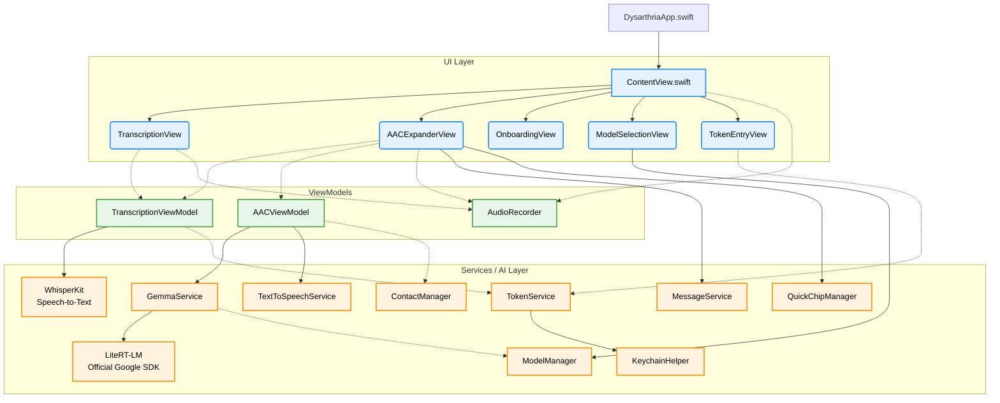

# SpeakEasy Architecture Overview

This document provides a high-level overview of the SpeakEasy iPad application's architecture, including its entry point, core components, and how the transcription and AI models interact.

## App Entry Point

The application's entry point is defined in **`DysarthriaApp.swift`** using the standard SwiftUI `@main` attribute. 

```swift
@main
struct DysarthriaApp: App {
    var body: some Scene {
        WindowGroup {
            ContentView()
        }
    }
}
```

When the app launches, it immediately loads **`ContentView.swift`**. The `ContentView` acts as the master coordinator for the entire application, maintaining the state for the core ViewModels and handling the main navigation (TabBar / Navigation Rail).

---

## Core Architecture Diagram

The application follows the **MVVM (Model-View-ViewModel)** design pattern. State is managed by a few central `ObservableObject` classes that communicate with dedicated background services.



---

## Component Breakdown

### 1. ViewModels (State Management)
*   **`TranscriptionViewModel.swift`**: Handles the WhisperKit audio transcription pipeline. It is integrated with the `TokenService` to only load WhisperKit when a valid custom model directory exists in `Documents/WhisperModels/`. It receives audio URLs, loads the Whisper model into the Neural Engine (ANE), and processes speech into text.
*   **`AACViewModel.swift`**: Manages the state for the "Smart Speak" tab. It takes shorthand text (from speech or Quick Chips), prepares prompts, and manages the generation of polished sentences.
*   **`AudioRecorder.swift`**: Handles microphone permissions, starting/stopping recordings, and saving temporary audio files for WhisperKit to process.

### 2. The Views
*   **`ContentView.swift`**: The root container. It listens for changes and coordinates tab routing. It gates the Transcribe tab: if the custom WhisperKit model is not downloaded, it renders `TokenEntryView` instead of `TranscriptionView`.
*   **`TranscriptionView.swift`**: The UI for the standard dictation feature.
*   **`AACExpanderView.swift`**: The UI for the AI expander. It displays the shorthand input, the generated options, and the Quick Chips.
*   **`TokenEntryView.swift`**: The access control page. It prompts the caregiver or patient to enter their paid subscription token, shows active download and unzipping progress, and handles model deactivation.

### 3. Services and Managers
*   **`TokenService.swift`**: A central service managing paid model credentials. It communicates with the Firebase Cloud Function, handles chunked model downloads, tracks progress, and unzips archives utilizing `ZIPFoundation`.
*   **`KeychainHelper.swift`**: Wraps the iOS Security Keychain APIs to safely persist the validation token offline.
*   **`GemmaService.swift`**: The bridge to the local LLM. It initializes the `EngineConfig` and `Engine` from Google's official `LiteRTLM` SDK, constructs the highly-specific "Speech-to-Intent" prompt with the user's name and contacts, and generates the 3 communication options.
*   **`ModelManager.swift`**: Handles fetching and selecting the appropriate Gemma models (e.g., Gemma 4 2B INT4 in `.litertlm` format) for local inference.
*   **`TextToSpeechService.swift`**: Utilizes iOS's `AVSpeechSynthesizer` to speak the generated sentences aloud.
*   **`QuickChipManager.swift`**: Manages the quick-access shortcut buttons (e.g., "🏀 Play", "🚽 Bathroom") that instantly populate the shorthand input.
*   **`ContactManager` / `MessageService`**: Retrieves the user's contacts to provide context to Gemma, and handles routing a generated message directly to the iOS Messages app.

## Summary of the Data Flow
1. User taps the microphone in `AACExpanderView`.
2. `AudioRecorder` saves the speech to a local file.
3. `TranscriptionViewModel` uses WhisperKit to turn the audio into raw, potentially fragmented text.
4. `ContentView` observes the transcription finishing and passes the text to `AACViewModel`.
5. `AACViewModel` calls `GemmaService.expandAAC()`.
6. `GemmaService` runs the text through the local Gemma 4 model on the GPU (Metal acceleration) with automatic CPU fallback.
7. The returned string is parsed into 3 distinct options, which are displayed in `AACExpanderView`.
8. The user can then tap "Speak" (handled by `TextToSpeechService`) or "Message" (handled by `MessageService`).

---

## Deep Dive: Google LiteRT-LM Engine

The application powers its on-device AI functionality using Google's official **LiteRT-LM** (`google-ai-edge/LiteRT-LM`), the production-ready inference framework specifically designed for edge LLMs.

### How It Works Under the Hood
1. **The Core Engine (C++)**: At the lowest level is Google's highly optimized C/C++ engine. LiteRT-LM was built specifically for edge devices, designed to run heavily compressed models (like quantized Gemma INT4 in `.litertlm` bundles) quickly and efficiently on mobile CPUs and GPUs without exhausting system memory.
2. **Official Swift SDK**: Google's official Swift package `LiteRTLM` provides a idiomatic Swift API:
   - **`EngineConfig` & `Engine`**: Configures model paths, hardware backend (`.gpu` with Metal acceleration, `.cpu`), and runtime cache directories (`cacheDir: NSTemporaryDirectory()`).
   - **`Conversation` & `Message`**: Encapsulates conversation state and multi-turn generation workflows.
   - **Precompiled Binaries**: Bundles official `CLiteRTLM` binary frameworks for Apple Silicon, eliminating the need to manually build native C++ runtimes.
3. **Modern Swift Integration**:
   - **Async/Await**: Function calls like `try await engine.initialize()` and `try await conversation.sendMessage()` are asynchronous and non-blocking, ensuring the iPad's UI remains responsive during inference.
   - **KV Caching**: The engine caches Key-Value (KV) states across conversational turns, optimizing Time-To-First-Token (TTFT) and throughput.

### The Local Execution Flow
When the app executes an AI request:
1. `GemmaService` initializes the `Engine` configured with `.gpu` Metal acceleration and maps the `.litertlm` model bundle.
2. The user's prompt (Swift `String`) is wrapped in a `Message` and passed to `conversation.sendMessage()`.
3. The underlying Google C++ engine tokenizes the text, performs inference math on the GPU, and streams the output back.
4. The SDK converts output tokens into Swift `String` (`response.toString`), handing them back to `AACViewModel` for option parsing and UI presentation.
