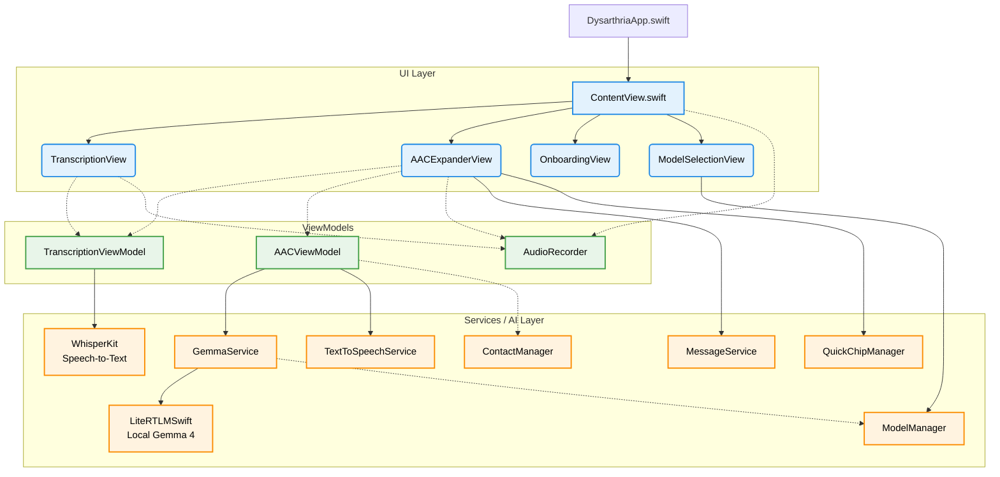

# SpeakEasy Architecture Overview

This document provides a high-level overview of the SpeakEasy iPad application's architecture, including its entry point, core components, and how the transcription and AI models interact.

## App Entry Point

The application's entry point is defined in **`DysarthriaApp.swift`** using the standard SwiftUI `@main` attribute. 

```swift
@main
struct DysarthriaApp: App {
    var body: some Scene {
        WindowGroup {
            ContentView()
        }
    }
}
```

When the app launches, it immediately loads **`ContentView.swift`**. The `ContentView` acts as the master coordinator for the entire application, maintaining the state for the core ViewModels and handling the main navigation (TabBar / Navigation Rail).

---

## Core Architecture Diagram

The application follows the **MVVM (Model-View-ViewModel)** design pattern. State is managed by a few central `ObservableObject` classes that communicate with dedicated background services.



---

## Component Breakdown

### 1. ViewModels (State Management)
*   **`TranscriptionViewModel.swift`**: Handles the WhisperKit audio transcription pipeline. It receives audio URLs, loads the Whisper model into the Neural Engine (ANE), and processes speech into text.
*   **`AACViewModel.swift`**: Manages the state for the "Smart Speak" tab. It takes shorthand text (from speech or Quick Chips), prepares prompts, and manages the generation of polished sentences.
*   **`AudioRecorder.swift`**: Handles microphone permissions, starting/stopping recordings, and saving temporary audio files for WhisperKit to process.

### 2. The Views
*   **`ContentView.swift`**: The root container. It listens for changes (like when `transcriptionVM` finishes transcribing) and routes the new text to the `AACViewModel` if the user is on the Smart Speak tab (Line 213).
*   **`TranscriptionView.swift`**: The UI for the standard dictation feature.
*   **`AACExpanderView.swift`**: The UI for the AI expander. It displays the shorthand input, the generated options, and the Quick Chips.

### 3. Services and Managers
*   **`GemmaService.swift`**: The bridge to the local LLM. It initializes the `LiteRTLMEngine`, constructs the highly-specific "Speech-to-Intent" prompt with the user's name and contacts, and generates the 3 communication options.
*   **`ModelManager.swift`**: Handles fetching and selecting the appropriate Gemma models (e.g., Gemma 4 2B INT4) for local inference.
*   **`TextToSpeechService.swift`**: Utilizes iOS's `AVSpeechSynthesizer` to speak the generated sentences aloud.
*   **`QuickChipManager.swift`**: Manages the quick-access shortcut buttons (e.g., "🏀 Play", "🚽 Bathroom") that instantly populate the shorthand input.
*   **`ContactManager` / `MessageService`**: Retrieves the user's contacts to provide context to Gemma, and handles routing a generated message directly to the iOS Messages app.

## Summary of the Data Flow
1. User taps the microphone in `AACExpanderView`.
2. `AudioRecorder` saves the speech to a local file.
3. `TranscriptionViewModel` uses WhisperKit to turn the audio into raw, potentially fragmented text.
4. `ContentView` observes the transcription finishing and passes the text to `AACViewModel`.
5. `AACViewModel` calls `GemmaService.expandAAC()`.
6. `GemmaService` runs the text through the local Gemma 4 model on the GPU.
7. The returned string is parsed into 3 distinct options, which are displayed in `AACExpanderView`.
8. The user can then tap "Speak" (handled by `TextToSpeechService`) or "Message" (handled by `MessageService`).

---

## Deep Dive: LiteRTLMSwift Engine

The application powers its on-device AI functionality using **LiteRTLMSwift**, a community-built Swift wrapper around Google's official **LiteRT-LM** (formerly TensorFlow Lite for Large Language Models).

### How It Works Under the Hood
1. **The Core Engine (C++)**: At the lowest level is Google's highly optimized C/C++ code. LiteRT was built specifically for edge devices, designed to run heavily compressed models (like quantized Gemma INT4) quickly and efficiently on mobile CPUs and GPUs without exhausting system memory.
2. **The Swift Bridge**: Since iOS apps are written in Swift, they cannot easily interface with raw C++ ML engines. `LiteRTLMSwift` serves as the bridge:
   - **C-API Interoperability**: It safely wraps raw C++ memory pointers and functions into modern Swift APIs.
   - **Precompiled Binaries**: It provides pre-built `.xcframework` binaries for Apple Silicon (arm64), completely bypassing the headache of compiling a complex C++ engine from source in Xcode.
3. **Modern Swift Integration**:
   - **Async/Await**: Function calls like `try await engine.generate()` are non-blocking, ensuring the iPad's UI remains perfectly responsive while the AI is "thinking" in the background.
   - **KV Caching**: The engine caches Key-Value (KV) states. If the user appends more words to their shorthand, the model doesn't need to re-process the entire prompt history. It only processes the new tokens, drastically cutting down the Time-To-First-Token (TTFT).

### The Local Execution Flow
When the app executes an AI request:
1. `GemmaService` tells the wrapper to map the `.task` model file straight from the iPad's SSD into memory.
2. The user's prompt (Swift `String`) is passed down and converted into a C-compatible format.
3. The underlying Google C++ engine tokenizes the text, performs inference math on the hardware, and streams the output back.
4. The wrapper converts these output C-strings back into Swift `String`s, handing them back to `AACViewModel` for UI display.
