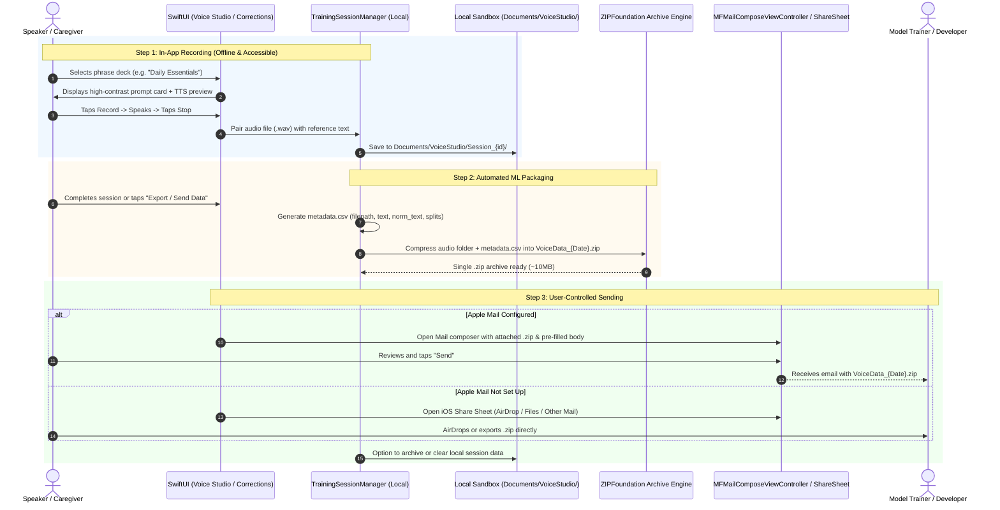

# Privacy-First In-App Voice Data Collection Design (Email & Local Archive)

## Overview
Training data for fine-tuning personalized Whisper models consists of paired audio clips (`.wav`, 16kHz mono) and reference transcription text. 

To completely eliminate privacy and compliance concerns regarding third-party cloud databases (such as Firestore or Firebase Storage), this design adopts a **100% local, privacy-first architecture**. 

Data collection happens entirely on-device, and transmission remains **user-controlled via Email (or AirDrop / Share Sheet)**. However, unlike the legacy cumbersome process, the app will:
1. Provide a **Guided Voice Training Studio ("Voice Studio")** where users or caregivers can record structured phrase decks with large accessibility controls.
2. Automatically bundle audio files and generate a machine-learning-ready `metadata.csv` (matching the exact schema needed by `train_personal_whisper.py`).
3. Package everything into a single `.zip` archive on device, eliminating email attachment size headaches, loose files, and manual transcript transcription.
4. Provide a 1-tap **"Send via Email"** (with automatic AirDrop/Share Sheet fallback if Apple Mail is not configured).

---

## User Review Required

> [!IMPORTANT]
> **Key Privacy & Workflow Highlights:**
> 1. **Zero Cloud/Server Storage**: No audio or text is ever sent to Firebase or external servers. All recordings stay in the app's local sandbox until the user explicitly emails or shares them.
> 2. **Automated ML Packaging**: The app will automatically zip the `.wav` files together with a pre-formatted `metadata.csv` (columns: `filepath,text,splits,scenario_group,norm_text`). When you receive the email, you can unzip it directly into `data/personal/` and start training immediately without any manual data entry.
> 3. **Smart Email Compression**: Audio files are packaged into a standard `.zip` archive, keeping file size well within email limits (~15-20 minutes of 16kHz mono speech is only ~10-15MB zipped).
> 4. **No-Mail Fallback (AirDrop / iCloud Drive / Caregiver)**: If an iPad does not have Apple Mail configured, a single tap opens the standard iOS Share Sheet to AirDrop the zip directly to a Mac, save to Files, or send via Gmail / Outlook.

---

## Open Questions

> [!NOTE]
> Please confirm your preferences on these workflow details:
> - **Question 1 (Placement)**: Should the **Voice Studio** be accessed via a new tab on the main navigation rail (Transcribe | Smart Speak | Voice Studio), or as a dedicated section in Settings / Advanced? *(Recommended: A prominent "Voice Studio" button/tile in the header or tab bar to make recording sessions easy to find).*
> - **Question 2 (Batch Size)**: Would you like guided recording decks to be broken into bite-sized sessions (e.g., 10 to 15 phrases per session) so the speaker does not experience vocal fatigue?
> - **Question 3 (Recipient Configuration)**: Should the developer/trainer recipient email be configured once in Settings (persisted across sessions) with an option to CC a caregiver?

---

## System Architecture



---

## User Experience & Accessibility Design

### 1. Guided Voice Training Studio ("Voice Studio")
Designed specifically for individuals with dysarthric speech and motor limitations:
- **Card-Based Carousel**: Displays one clear phrase at a time with **44pt bold** typography.
- **Listen First (TTS)**: A prominent speaker button plays how the prompt sounds via iPad text-to-speech so the user knows what to say.
- **Oversized Record Button**: Sized at **120pt** (iPad) / **90pt** (iPhone) for easy targeting.
- **Audio Feedback**: Real-time waveform / audio level indicator showing that sound is being received.
- **Immediate Playback & Redo**: The user can play back their recording with one tap, redo if they stuttered or coughed, or tap "Keep & Next".
- **Session Progress & Fatigue Breaks**: A clear progress indicator (e.g. `Phrase 7 of 15`) with encouraging checkpoints and pause reminders.

#### Wireframe: Voice Studio Recording Screen
```
+-------------------------------------------------------------------+
|  [< Exit]               Voice Training Studio             [Deck v] |
+-------------------------------------------------------------------+
|                                                                   |
|   Session: Daily Essentials                  Progress: [7 / 15]   |
|                                                                   |
|   +-----------------------------------------------------------+   |
|   |                                                           |   |
|   |              "Could you please turn on the light?"        |   |
|   |                                                           |   |
|   |                 [ 🔊 Listen to Prompt ]                   |   |
|   +-----------------------------------------------------------+   |
|                                                                   |
|                  [ |||| Live Audio Waveform |||| ]                |
|                                                                   |
|                      +---------------------+                      |
|                      |                     |                      |
|                      |      ( ● RECORD )   |                      |
|                      |     (120pt Circle)  |                      |
|                      |                     |                      |
|                      +---------------------+                      |
|                                                                   |
|    [ ⟲ Redo ]            [ ▶ Play Recording ]       [ Next ➔ ]    |
+-------------------------------------------------------------------+
```

---

### 2. Session Summary & 1-Tap Export
At the end of a guided session (or from the "Saved Phrases" screen):
- Displays total phrases recorded and total audio length (e.g. `15 phrases recorded (2m 45s total)`).
- **Primary Action**: Large blue button: **"Send Voice Data via Email"** (`envelope.fill`).
  - Pre-fills developer recipient email from Settings.
  - Generates `VoiceData_Session_2026-09-03.zip`.
  - Attaches the `.zip` archive.
- **Secondary Action**: Accessible button: **"AirDrop or Save to Files"** (`square.and.arrow.up`).
  - Opens native iOS Share Sheet so caregivers can AirDrop the zip directly to a computer without using email at all.
- **Clean Storage Action**: Once sent or exported, gives the user an easy 1-tap option to clear local session audio so device storage remains lightweight.

---

### 3. In-Situ Live Correction Quick-Batching
On the main **Transcribe** screen:
- When the user taps "Incorrect?" and edits the transcript:
  - Tapping **"Save Correction"** automatically saves the `.wav` and corrected text into the local "Training Queue".
  - A subtle counter badge appears near Settings or the header: `✓ 3 corrections ready to export`.
  - In Settings / Advanced, users can tap **"Send Corrections Batch"** anytime, which zips and emails all pending corrections in one click.

---

## Dataset Format for Whisper Fine-Tuning

The app generates a `metadata.csv` inside each exported zip archive that strictly adheres to the schema expected by `ml/whisper_finetuning/train_personal_whisper.py` and `normalize_whisper_metadata.py`:

```csv
filepath,text,norm_text,splits,scenario_group,recorded_at
audio/sample_001.wav,"Could you please turn on the light?","could you please turn on the light",train,daily_essentials,2026-09-03T21:30:00Z
audio/sample_002.wav,"I need water please","i need water please",train,daily_essentials,2026-09-03T21:31:15Z
audio/sample_003.wav,"Good morning everyone","good morning everyone",train,greetings,2026-09-03T21:32:00Z
```

**Directory Structure inside the exported `.zip`:**
```
VoiceData_2026-09-03_Session/
├── metadata.csv
└── audio/
    ├── sample_001.wav   (16,000 Hz, 16-bit Mono Linear PCM)
    ├── sample_002.wav
    └── sample_003.wav
```
When you receive the email, you simply extract this folder into `data/personal/` and pass the CSV directly to `train_personal_whisper.py`. No conversion, renaming, or manual alignment needed.

---

## Proposed Changes

### iOS App (`DysarthriaApp/`)

#### [NEW] [TrainingSessionManager.swift](file:///c:/Users/Dalai/dev/dysarthria-app/DysarthriaApp/TrainingSessionManager.swift)
- Manages recording sessions, audio file persistence in `Documents/VoiceStudio/`, and session metadata.
- Generates `metadata.csv` with normalized text.
- Integrates with `ZIPFoundation` (already included in the project for model unzipping) to compress the session into a single `.zip` file.
- Tracks pending live corrections and completed guided decks.

#### [NEW] [PromptDecks.swift](file:///c:/Users/Dalai/dev/dysarthria-app/DysarthriaApp/PromptDecks.swift)
- Curated prompt lists grouped by category:
  - **Daily Essentials** (needs, pain, environment control)
  - **Social & Greetings** (conversational phrases)
  - **Phonetic Variety** (short sentences covering key consonants/vowels)
  - **Custom Deck** (allows caregivers to add user-specific names or phrases)

#### [NEW] [VoiceStudioView.swift](file:///c:/Users/Dalai/dev/dysarthria-app/DysarthriaApp/VoiceStudioView.swift)
- Full-screen or modal accessible recording studio with prompt carousel, TTS preview, 120pt record button, and audio playback.
- Session completion view with 1-tap "Send via Email" and "Share / AirDrop Archive".

#### [MODIFY] [ContentView.swift](file:///c:/Users/Dalai/dev/dysarthria-app/DysarthriaApp/ContentView.swift)
- Add a direct entry button for "Voice Studio" (e.g. in the top header or landscape rail).
- Update the "Incorrect?" flow so corrections are automatically queued into `TrainingSessionManager` without forcing users to open email after each single correction.

#### [MODIFY] [TranscriptionViewModel.swift](file:///c:/Users/Dalai/dev/dysarthria-app/DysarthriaApp/TranscriptionViewModel.swift)
- Route saved corrections directly to `TrainingSessionManager.shared.addLiveCorrection(...)`.

---

## Verification Plan

### Manual Verification on iPad / Simulator
1. **Guided Recording Flow**:
   - Open Voice Studio -> Select "Daily Essentials" deck.
   - Tap "Listen to Prompt" to verify Text-to-Speech pronunciation.
   - Record 3-5 phrases, verify playback and "Next" navigation.
2. **ZIP & Metadata Generation**:
   - Complete the session and tap "Export / Send".
   - Verify the resulting `.zip` file contains valid 16kHz mono `.wav` files and a properly structured `metadata.csv`.
3. **Email & Share Sheet Flow**:
   - Verify `MailView` opens with the `.zip` attached, correct recipient, and informative email body.
   - Verify Share Sheet fallback works for AirDrop or saving directly to the iPad "Files" app.
4. **ML Compatibility**:
   - Verify `metadata.csv` can be parsed by `ml/whisper_finetuning/normalize_whisper_metadata.py` with zero syntax or format errors.
