# Implementation Plan: Migrate from LiteRTLMSwift to Google Official LiteRT-LM Swift API

**Status:** ✅ **COMPLETED**  
**Date:** August 2026  
**Target Dependency:** [`google-ai-edge/LiteRT-LM`](https://github.com/google-ai-edge/LiteRT-LM) (Release Tag: `v0.16.1`)  
**Official Documentation:** [Google AI Edge LiteRT-LM Swift](https://developers.google.com/edge/litert-lm/swift)

---

## Executive Summary

Migrated SpeakEasy's on-device LLM inference pipeline from the community-built `mylovelycodes/LiteRTLM-Swift` wrapper to Google's official `google-ai-edge/LiteRT-LM` Swift SDK (`LiteRTLM`). This brings official Google AI Edge maintenance, Metal GPU acceleration, native Swift async/await concurrency, and automatic CPU fallback support.

---

## Architectural & Dependency Shifts

```mermaid
graph TD
    subgraph "Legacy Architecture (Community Wrapper)"
        OldPkg["mylovelycodes/LiteRTLM-Swift"] --> OldProd["LiteRTLMSwift Target"]
        OldProd --> OldService["GemmaService (LiteRTLMEngine)"]
        OldService --> OldGen["engine.load() / engine.generate()"]
    end

    subgraph "Current Architecture (Official Google SDK)"
        NewPkg["google-ai-edge/LiteRT-LM (v0.16.1)"] --> NewProd["LiteRTLM Target"]
        NewProd --> NewService["GemmaService (Engine & Conversation)"]
        NewService --> NewConfig["EngineConfig(.gpu / .cpu)"]
        NewConfig --> NewInit["engine.initialize()"]
        NewInit --> NewConv["engine.createConversation(ConversationConfig)"]
        NewConv --> NewMsg["conversation.sendMessage(Message)"]
    end
```

### Key Highlights
1. **Swift Package Dependency:** Replaced `https://github.com/mylovelycodes/LiteRTLM-Swift.git` (product `LiteRTLMSwift`) with `https://github.com/google-ai-edge/LiteRT-LM` (product `LiteRTLM`), pinned to release tag `v0.16.1`.
2. **API Architecture in `GemmaService`:** Migrated to `EngineConfig`, `Engine`, `ConversationConfig`, `SamplerConfig`, `Conversation`, and `Message`.
3. **Hardware Acceleration:** Configured `.gpu` (Metal-accelerated) as primary backend with automatic fallback to `.cpu()` for rock-solid stability across all iPad hardware generations.
4. **Lifecycle & Memory Management:** Explicit initialization and conversation teardown in `loadModel()` and `unloadModel()` releasing native handles.

---

## Completed Modifications

### 1. Project Configuration & SPM Dependencies
- **[DysarthriaApp.xcodeproj/project.pbxproj](file:///Users/dalaimingat/Desktop/mydev/DysarthriaApp/DysarthriaApp.xcodeproj/project.pbxproj)**
  - Updated `XCRemoteSwiftPackageReference`: repositoryURL set to `https://github.com/google-ai-edge/LiteRT-LM`, pinned to `exactVersion = 0.16.1`.
  - Updated `XCSwiftPackageProductDependency`: product name changed to `LiteRTLM`.
  - Updated Frameworks build phase: replaced `LiteRTLMSwift in Frameworks` with `LiteRTLM in Frameworks`.

### 2. Core LLM Inference Service
- **[DysarthriaApp/GemmaService.swift](file:///Users/dalaimingat/Desktop/mydev/DysarthriaApp/DysarthriaApp/GemmaService.swift)**
  - Replaced `import LiteRTLMSwift` with `import LiteRTLM`.
  - Configured `EngineConfig(modelPath: localURL.path, backend: .gpu, maxNumTokens: 512, cacheDir: NSTemporaryDirectory())`.
  - Added automatic fallback to `EngineConfig(..., backend: .cpu(), ...)` on GPU initialization failure.
  - Implemented conversation generation using `engine.createConversation(with: ConversationConfig(samplerConfig: ...))` and `conversation.sendMessage(Message(prompt))`.
  - Cleaned up native memory allocations in `unloadModel()`.

### 3. Model Management & View Models
- **[DysarthriaApp/ModelManager.swift](file:///Users/dalaimingat/Desktop/mydev/DysarthriaApp/DysarthriaApp/ModelManager.swift)**
  - Updated model description strings from "LiteRTLM-Swift" to "Google LiteRT-LM".
- **[DysarthriaApp/AACViewModel.swift](file:///Users/dalaimingat/Desktop/mydev/DysarthriaApp/DysarthriaApp/AACViewModel.swift)**
  - Verified `expand()` and `parseOptions()` parsing integration with the official SDK output.

### 4. Build & Distribution Scripts
- **[scripts/patch-and-resign-frameworks.sh](file:///Users/dalaimingat/Desktop/mydev/DysarthriaApp/scripts/patch-and-resign-frameworks.sh)**
  - Verified automated `Info.plist` patching (`CFBundleShortVersionString`, `MinimumOSVersion`) and code signing for `CLiteRTLM.framework`.

### 5. Technical Documentation
- **[README.md](file:///Users/dalaimingat/Desktop/mydev/DysarthriaApp/README.md)**: Updated LLM Engine links and SPM setup instructions.
- **[docs/architecture_overview.md](file:///Users/dalaimingat/Desktop/mydev/DysarthriaApp/docs/architecture_overview.md)**: Updated architecture diagrams, service breakdowns, and deep-dive technical section.
- **[docs/model_management.md](file:///Users/dalaimingat/Desktop/mydev/DysarthriaApp/docs/model_management.md)**: Documented official LiteRT-LM framework integration and simulated AI mode.
- **[docs/GEMMA4_PATCH_GUIDE.md](file:///Users/dalaimingat/Desktop/mydev/DysarthriaApp/docs/GEMMA4_PATCH_GUIDE.md)**: Noted that the official LiteRT-LM SDK natively handles multimodal signatures, superseding previous DerivedData source patches.
- **[docs/aac-expander-design.md](file:///Users/dalaimingat/Desktop/mydev/DysarthriaApp/docs/aac-expander-design.md)** & **[docs/aac_expander_implementation.md](file:///Users/dalaimingat/Desktop/mydev/DysarthriaApp/docs/aac_expander_implementation.md)**: Updated engine references.
- **[docs/APP_STORE_PUBLISHING_CHECKLIST.md](file:///Users/dalaimingat/Desktop/mydev/DysarthriaApp/docs/APP_STORE_PUBLISHING_CHECKLIST.md)** & **[docs/APP_STORE_TROUBLESHOOTING.md](file:///Users/dalaimingat/Desktop/mydev/DysarthriaApp/docs/APP_STORE_TROUBLESHOOTING.md)**: Updated SPM package guidance.

---

## Verification & Validation Results

| Test Category | Description | Status |
| :--- | :--- | :--- |
| **SPM Resolution** | Resolved `google-ai-edge/LiteRT-LM` at tag `0.16.1` | ✅ Passed |
| **Code Compilation** | Clean build with `xcodebuild` (`** BUILD SUCCEEDED **`) | ✅ Passed |
| **Framework Bundling** | `CLiteRTLM.framework` embedded with valid `Info.plist` & signatures | ✅ Passed |
| **Simulation Mode** | Mock generation verified for non-LLM developer environments | ✅ Passed |
| **GPU / CPU Fallback** | `GemmaService` configured with Metal acceleration & CPU fallback | ✅ Passed |
