# Implementation Plan: Migrate from LiteRTLMSwift to Google Official LiteRT-LM Swift API

Migrate SpeakEasy's on-device LLM inference pipeline from the community-built [mylovelycodes/LiteRTLM-Swift](https://github.com/mylovelycodes/LiteRTLM-Swift) wrapper to Google's official [google-ai-edge/LiteRT-LM](https://github.com/google-ai-edge/LiteRT-LM) Swift API documented at [Google AI Edge LiteRT-LM Swift](https://developers.google.com/edge/litert-lm/swift).

---

## User Review Required

> [!IMPORTANT]
> **Key Architectural & Dependency Shifts:**
> 1. **Swift Package Dependency Replacement:** Replaces `https://github.com/mylovelycodes/LiteRTLM-Swift.git` (product `LiteRTLMSwift`) with `https://github.com/google-ai-edge/LiteRT-LM` (product `LiteRTLM`).
> 2. **API Refactoring in `GemmaService`:** Transitions from custom `LiteRTLMEngine(modelPath:backend:)` to official `EngineConfig` + `Engine` + `Conversation` + `Message` API.
> 3. **Hardware Backend Execution:** Defaults to `.gpu` (Metal-accelerated) with fallback handling to `.cpu` for stability across diverse iPad hardware.
> 4. **Model Lifecycle & Memory Management:** Explicitly handles `engine.initialize()`, `engine.createConversation()`, and teardown/cleanup to prevent memory pressure or precondition errors on iOS.

---

## Open Questions

> [!NOTE]
> 1. **SPM Version Pinning:** Google's `google-ai-edge/LiteRT-LM` repository releases periodic version tags. Should we pin to a specific release tag (e.g. latest stable release tag) or track the `main` branch? *(Recommended: Pin to the latest tagged release to avoid Swift wrapper / binary mismatch)*.
> 2. **Hardware Acceleration Preference:** Should the app attempt GPU (Metal) execution first with automatic fallback to CPU if initialization fails, or should there be a user-configurable toggle in Settings/Model Management? *(Recommended: Automatic fallback in `GemmaService` with debug logging)*.

---

## Proposed Changes

```mermaid
graph TD
    subgraph "Before (Community Wrapper)"
        OldPkg["mylovelycodes/LiteRTLM-Swift"] --> OldProd["LiteRTLMSwift Target"]
        OldProd --> OldService["GemmaService (LiteRTLMEngine)"]
        OldService --> OldGen["engine.load() / engine.generate()"]
    end

    subgraph "After (Google Official SDK)"
        NewPkg["google-ai-edge/LiteRT-LM"] --> NewProd["LiteRTLM Target"]
        NewProd --> NewService["GemmaService (Engine & Conversation)"]
        NewService --> NewConfig["EngineConfig(.gpu / .cpu)"]
        NewConfig --> NewInit["engine.initialize()"]
        NewInit --> NewConv["engine.createConversation()"]
        NewConv --> NewMsg["conversation.sendMessage(Message)"]
    end
```

---

### Project Configuration & Package Dependencies

#### [MODIFY] [DysarthriaApp.xcodeproj/project.pbxproj](file:///c:/Users/Dalai/dev/dysarthria-app/DysarthriaApp.xcodeproj/project.pbxproj)
- Update `XCRemoteSwiftPackageReference`:
  - Change URL from `https://github.com/mylovelycodes/LiteRTLM-Swift.git` to `https://github.com/google-ai-edge/LiteRT-LM`.
- Update `XCSwiftPackageProductDependency`:
  - Change product name from `LiteRTLMSwift` to `LiteRTLM`.
- Update Frameworks build phase:
  - Replace `LiteRTLMSwift in Frameworks` reference with `LiteRTLM in Frameworks`.

---

### Core LLM Inference Service

#### [MODIFY] [DysarthriaApp/GemmaService.swift](file:///c:/Users/Dalai/dev/dysarthria-app/DysarthriaApp/GemmaService.swift)
- Replace `import LiteRTLMSwift` with `import LiteRTLM`.
- Replace `private var engine: LiteRTLMEngine?` with Google's official `Engine` and active `Conversation` state references.
- Refactor `loadModel()`:
  - Configure `EngineConfig(modelPath: localURL.path, backend: .gpu, cacheDir: NSTemporaryDirectory())`.
  - Include fallback handling to `.cpu` if GPU initialization is unsupported or throws an error.
  - Call `let engine = Engine(engineConfig: config)` and `try await engine.initialize()`.
  - Update `@Published var isModelLoaded` state.
- Refactor `expandAAC(shorthand:userName:contacts:)`:
  - Preserve the role/intent prompt construction and simulation mode support.
  - Create a conversation instance via `try await engine.createConversation()` (with optional `ConversationConfig` / `SamplerConfig` if customizing temperature/topP/tokens).
  - Send the formatted intent prompt via `conversation.sendMessage(Message(prompt))`.
  - Extract and return the generated text (`response.toString`).
- Refactor `unloadModel()`:
  - Close active conversations and nil out the engine reference to release native memory allocations.

---

### Model Management & View Models

#### [MODIFY] [DysarthriaApp/ModelManager.swift](file:///c:/Users/Dalai/dev/dysarthria-app/DysarthriaApp/ModelManager.swift)
- Update model description strings from "LiteRTLM-Swift" to "Google LiteRT-LM".

#### [VERIFY] [DysarthriaApp/AACViewModel.swift](file:///c:/Users/Dalai/dev/dysarthria-app/DysarthriaApp/AACViewModel.swift)
- Verify `AACViewModel.expand()` and `parseOptions()` correctly process output strings from the official SDK without requiring breaking signature changes.

---

### Build & Distribution Scripts

#### [MODIFY] [scripts/patch-and-resign-frameworks.sh](file:///c:/Users/Dalai/dev/dysarthria-app/scripts/patch-and-resign-frameworks.sh)
- Review and verify compatibility with `CLiteRTLM.framework` provided in the official `google-ai-edge/LiteRT-LM` binary release.
- Ensure automated `Info.plist` patching (`CFBundleShortVersionString`, `MinimumOSVersion`), dylib wrapping (`libGemmaModelConstraintProvider.dylib` if present), and framework re-signing operate smoothly on official binaries.

---

### Documentation

#### [MODIFY] [README.md](file:///c:/Users/Dalai/dev/dysarthria-app/README.md)
- Update LLM Engine links and setup instructions to reference Google's official LiteRT-LM repository (`https://github.com/google-ai-edge/LiteRT-LM`) and documentation.

#### [MODIFY] [docs/architecture_overview.md](file:///c:/Users/Dalai/dev/dysarthria-app/docs/architecture_overview.md)
- Update Section "Deep Dive: LiteRTLMSwift Engine" to "Deep Dive: Google LiteRT-LM Engine".
- Update Mermaid architecture diagram node labels from `LiteRTLMSwift` to `LiteRT-LM (Official Google SDK)`.

#### [MODIFY] [docs/model_management.md](file:///c:/Users/Dalai/dev/dysarthria-app/docs/model_management.md)
- Update references regarding the Swift runtime integration from community package to official Google AI Edge package.

#### [MODIFY] [docs/GEMMA4_PATCH_GUIDE.md](file:///c:/Users/Dalai/dev/dysarthria-app/docs/GEMMA4_PATCH_GUIDE.md)
- Document that official LiteRT-LM releases resolve/supersede the manual vision signature patch previously required by community forks.

---

## Verification Plan

### Automated & Build Verification
- **Package Resolution:** Verify Xcode / SwiftPM resolves `https://github.com/google-ai-edge/LiteRT-LM` without target conflicts.
- **Code Compilation:** Verify `GemmaService.swift` and all dependent views compile cleanly without warnings or deprecated symbol issues.

### Manual & Functional Verification
1. **Simulation Mode Check:**
   - Toggle `use_ai_simulation = true` in app settings.
   - Run AAC expander in `AACExpanderView` to ensure mock generation continues to work seamlessly.
2. **On-Device Inference Flow:**
   - Download the `.litertlm` Gemma 4 model using `ModelManager`.
   - Select the model and trigger expansion from `AACExpanderView`.
   - Verify prompt processing, latency, and 3-sentence option generation.
3. **App Store Archive Validation:**
   - Run `/bin/sh scripts/patch-and-resign-frameworks.sh` in build pipeline / test run.
   - Verify `CLiteRTLM.framework` passes bundle structure, plist versioning, and code signing checks.
