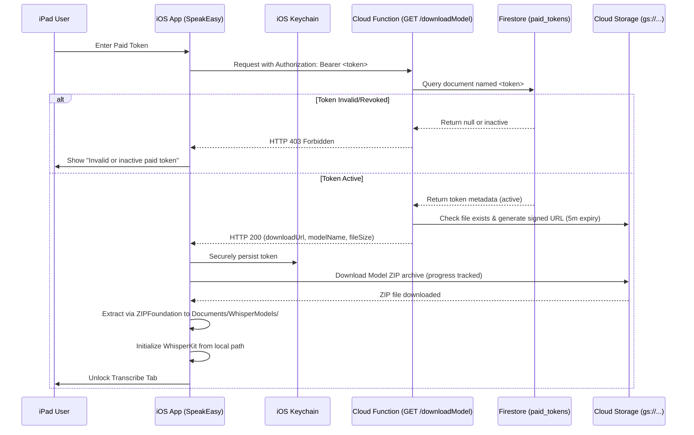

# Phase 1: Token-Based Access Control Setup Guide

This guide details how to configure, deploy, and operate the Token-Based Access Control system for the SpeakEasy dysarthria iPad application. This system restricts speech model access so that only authorized, paying subscribers can download and initialize their personalized WhisperKit models.

---

## 1. Architecture Overview



---

## 2. Firebase Backend Setup

All backend configuration and source code are located in the `backend/` directory.

### Prerequisites
- Node.js 18 or 20 installed.
- Firebase CLI installed (`npm install -g firebase-tools`).

### Deployment Steps
1. Log in to Firebase:
   ```bash
   firebase login
   ```
2. Link the project (replace with your Firebase project ID):
   ```bash
   firebase use --add YOUR_PROJECT_ID
   ```
3. Install Cloud Function dependencies:
   ```bash
   cd backend/functions
   npm install
   ```
4. Deploy security rules and functions:
   ```bash
   cd backend
   firebase deploy --only firestore:rules,functions
   ```

---

## 3. Database Schema

Tokens are stored in the Firestore collection `paid_tokens`. The document ID should match the token string for fast lookup.

### Firestore Document Structure (`paid_tokens/{token}`)

| Field | Type | Description | Example |
| :--- | :--- | :--- | :--- |
| `paid_token` | String | (Optional fallback) The token string | `"tkn_live_789xYz..."` |
| `token_status` | String | State of token. Must be `"active"` to download | `"active"` or `"revoked"` |
| `model_storage_path` | String | GCS URI or relative path to the zipped model | `"gs://speakeasy-models/models/user_abc123.zip"` |
| `model_name` | String | Friendly name for the user's voice model | `"John-Doe-Dysarthria-v1"` |

---

## 4. Preparing & Uploading Models

Custom models fine-tuned for a specific user must be packed into a ZIP archive and uploaded to Cloud Storage before the user can activate their token.

### Packing WhisperKit Models
Ensure the ZIP contains the model folder structure. The model configuration file `config.json` must be present.

Example directory structure inside the ZIP:
```text
CustomDysarthriaModel/
  ├── config.json
  ├── vocabulary.txt
  ├── MelSpectrogram.mlmodelc/
  ├── AudioEncoder.mlmodelc/
  └── TextDecoder.mlmodelc/
```
*Note: If the zip structure is flattened (files at root), the app will automatically handle it and initialize correctly.*

Compress the folder:
```bash
zip -r John-Doe-Dysarthria-v1.zip CustomDysarthriaModel/
```

### Uploading to Storage
Upload the resulting ZIP file to your Cloud Storage bucket (e.g., to a `models/` folder). Note the storage path, and set the corresponding `model_storage_path` in the Firestore token document.

---

## 5. iOS Integration (Part 2 Tasks on macOS)

When moving to macOS to build and run the iPad app, perform the following integration steps:

### A. Add ZIPFoundation SPM Dependency
ZIPFoundation is used to extract the model archive locally:
1. Open `DysarthriaApp.xcodeproj` in Xcode.
2. Go to **File** > **Add Packages...**
3. Paste the URL: `https://github.com/weichsel/ZIPFoundation.git`
4. Select the latest version and add it to the `DysarthriaApp` target.

### B. Configure Backend URL
In `DysarthriaApp/TokenService.swift`, modify the `backendUrlString` property with your live Firebase Cloud Function URL:
```swift
private let backendUrlString = "https://<region>-<project-id>.cloudfunctions.net/downloadModel"
```

### C. Remove Bundled Model
Under Option A, we ship the app without any pre-bundled WhisperKit model.
- Remove any existing `CustomDysarthriaModel` folder references from the Xcode project file hierarchy (ensure it is not in "Copy Bundle Resources").

### D. Compile and Verify
1. Build the application in Xcode.
2. On initial run, select the **Transcribe** tab. It will display the activation screen.
3. Enter a valid token created in Firestore and tap **Activate & Download Model**.
4. Verify the progress indicator is functional, the archive extracts, and the transcription model loads successfully.

---

## 6. Token Revocation & Deactivation

- To temporarily deactivate access, change `token_status` in Firestore to `"revoked"` or `"disabled"`.
- To completely delete a user's local model cache and credentials, the caregiver/user can tap **Deactivate and Delete Model Data** at the bottom of the active token screen inside the app. This deletes the token from the Keychain and purges the downloaded directory from disk.

---

## 7. Production Model Provisioning & Token Creation Walkthrough

Follow these visual steps in the Firebase Console to issue a new model to a user:

### Step A: Upload the ZIP Model
1. Go to the [Firebase Storage Console](https://console.firebase.google.com/project/speak-easy-6eb6e/storage).
2. Inside your default storage bucket, click **Create folder** and name it `models`.
3. Enter the `models` folder.
4. Click **Upload file** and select the custom user's Whisper model ZIP archive (e.g. `john_doe_whisper.zip`).
5. Once uploaded, the file path is: `models/john_doe_whisper.zip`.

### Step B: Create the Token in Firestore
1. Go to the [Firestore Database Console](https://console.firebase.google.com/project/speak-easy-6eb6e/firestore).
2. If the collection does not exist yet, click **Start collection** and name it `paid_tokens`.
3. Click **Add document** and set:
   * **Document ID**: `tkn_live_doe789` *(This is the token string you will email to the patient).*
   * **Fields**:
     * `token_status` (String): `active`
     * `model_storage_path` (String): `models/john_doe_whisper.zip` *(Relative or full gs:// paths are both supported).*
     * `model_name` (String): `John Doe Voice Profile` *(This friendly name displays in the app on download completion).*

---

## 8. Future Maintenance & Operations Guide

This section outlines standard procedures for maintaining the access control system and performing updates.

### A. Releasing Voice Model Updates (v2, v3, etc.)
If a patient's model is retrained and a new version needs to be deployed:
1. Package and upload the new ZIP file to Cloud Storage at a new path (e.g., `models/john_doe_whisper_v2.zip`).
2. Open the Firestore document for the user's token and update:
   * `model_storage_path` to the new path (`models/john_doe_whisper_v2.zip`).
   * `model_name` to reflect the new version (e.g. `John Doe Profile v2`).
3. To force the user's iPad to fetch the new model:
   * Ask the user/caregiver to tap **Deactivate and Delete Model Data** at the bottom of the active token screen.
   * Re-enter the same token. The app will immediately pull and unzip the new `v2` model.

### B. Revoking Subscriber Access
* To disable access, set `token_status` in the Firestore document to `"revoked"` or `"inactive"`.
* **Note**: Because the app runs offline-first for accessibility safety, the local model remains functional on the user's device even after a token is revoked. However, the user will not be able to re-download or activate the model on a new device.

### C. Updating Firebase Cloud Function Packages
To keep the backend secure and upgrade dependencies:
1. Navigate to the functions directory:
   ```bash
   cd backend/functions
   ```
2. Update packages to the latest compatible versions:
   ```bash
   npm install --save firebase-functions@latest firebase-admin@latest
   ```
3. Redeploy the functions to production:
   ```bash
   firebase deploy --only functions --force
   ```

### D. Billing Alerts & Cost Monitoring
To ensure your production costs stay within the free tier limits:
1. Go to the [Google Cloud Billing Console](https://console.cloud.google.com/billing).
2. Go to **Budgets & Alerts** and click **Create Budget**.
3. Set a threshold budget (e.g., $10.00/month) and configure email notifications to alert you if the resource downloads or Firestore reads spike abnormally.


