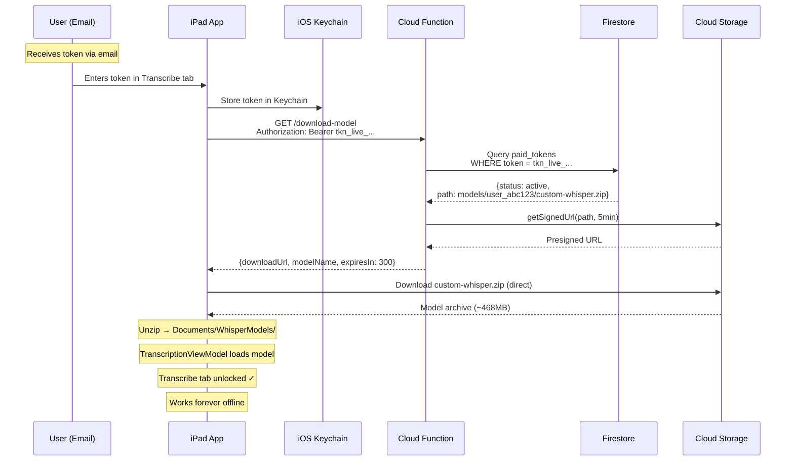

# Phase 1: Token-Based Access Control for WhisperKit Model Downloads

Gate the **custom dysarthria-trained WhisperKit model** behind a paid token. Users enter a token (received via email) → backend validates → returns presigned URL → iPad downloads the user's unique custom speech model → `TranscriptionViewModel` loads it from local storage.

## Design Decisions (Resolved)

| Decision | Choice |
|---|---|
| **No bundled model** | App ships without any WhisperKit model. Transcribe tab is locked until token activation. |
| **Token distribution** | Manual via email. Tokens created in Firestore console. |
| **Model scope** | Per-user. Each user gets their own unique fine-tuned WhisperKit model. |
| **Offline behavior** | Works forever offline after download. No re-validation. |
| **Backend platform** | Firebase (Cloud Functions + Firestore + Cloud Storage) |

---

# Part 1: Windows (Can Do Now) 🖥️

Everything below can be built and tested on your current Windows machine.

---

## 1A. Backend: Firebase Cloud Functions + Firestore

#### [NEW] `backend/functions/index.js`

Firebase Cloud Function — single HTTPS endpoint:

```
GET /download-model
Headers: Authorization: Bearer <paid_token>
```

**Logic:**
1. Extract token from `Authorization` header
2. Query Firestore `paid_tokens` collection where `token == <provided_token>`
3. Verify `token_status == "active"`
4. Retrieve `model_storage_path` from the matched document (per-user path)
5. Generate a **5-minute presigned download URL** via `getSignedUrl()`
6. Return JSON:
```json
{
  "downloadUrl": "https://storage.googleapis.com/...",
  "modelName": "custom-dysarthria-whisper",
  "fileSize": 490000000,
  "expiresIn": 300
}
```
7. On failure: `401 Invalid Token`, `403 Token Revoked`, `404 Not Found`

#### [NEW] `backend/functions/package.json`

Dependencies: `firebase-functions`, `firebase-admin`, `@google-cloud/storage`

#### [NEW] `backend/firestore.rules`

Lock down `paid_tokens` collection to admin-only access.

#### [NEW] `backend/firebase.json`

Firebase project configuration for deploying functions.

#### Firestore Collection Design: `paid_tokens`

```
{
  user_id: "user_abc123",
  token: "tkn_live_789xYz...",
  model_storage_path: "models/user_abc123/custom-whisper.zip",
  token_status: "active",      // "active" | "revoked"
  created_at: Timestamp
}
```

### Windows Testing

```bash
# Install Firebase CLI, initialize project, start emulators
cd backend/functions
npm install
firebase emulators:start

# Test valid/invalid tokens with curl
curl -H "Authorization: Bearer tkn_test_123" http://localhost:5001/<project>/us-central1/download-model
```

---

## 1B. Swift Source Files (Written on Windows, Integrated on macOS)

These Swift files will be written and ready to go. On macOS you'll just drag them into the Xcode project.

#### [NEW] `DysarthriaApp/KeychainHelper.swift`

Lightweight iOS Keychain wrapper using `Security.framework` (no external dependencies):

- `save(key:, data:)` — `SecItemAdd` / `SecItemUpdate`
- `load(key:) -> Data?` — `SecItemCopyMatching`
- `delete(key:)` — `SecItemDelete`
- Service identifier: `"com.dysarthriaapp.paidtoken"`

#### [NEW] `DysarthriaApp/TokenService.swift`

Singleton managing the full token lifecycle:

```swift
class TokenService: ObservableObject {
    static let shared = TokenService()

    @Published var tokenStatus: TokenStatus = .none
    // .none | .validating | .active | .error(String)

    @Published var isDownloading: Bool = false
    @Published var downloadProgress: Double = 0.0

    func saveToken(_ token: String)                                  // → Keychain
    func loadToken() -> String?                                      // ← Keychain
    func deleteToken()                                               // × Keychain
    func validateAndGetDownloadURL() async throws -> ModelDownloadResponse  // → API
    func downloadModel(from url: URL) async throws -> URL            // → Cloud Storage
}
```

**Key behaviors:**
- On launch: checks Keychain for token AND checks disk for model. If both exist → `.active` (no network call — offline forever)
- On first entry: validates with backend → downloads zip → unzips → saves token to Keychain

#### [NEW] `DysarthriaApp/TokenEntryView.swift`

SwiftUI view for the Transcribe tab when no model exists:

1. **No token:** Branded intro, `SecureField` for token, large "Activate" button, paste shortcut
2. **Validating:** Spinner — "Verifying your access..."
3. **Downloading:** Progress bar with percentage
4. **Success:** Green checkmark → auto-transitions to `TranscriptionView`
5. **Error:** Red banner with retry

#### [MODIFY] `DysarthriaApp/TranscriptionViewModel.swift`

Prepare the modified version of [TranscriptionViewModel.swift](file:///c:/Users/Dalai/dev/dysarthria-app/DysarthriaApp/TranscriptionViewModel.swift):

1. **Remove auto-loading from `init()`** — currently [lines 35-37](file:///c:/Users/Dalai/dev/dysarthria-app/DysarthriaApp/TranscriptionViewModel.swift#L35-L37) fire `initializeWhisperKit()` immediately. Remove this.

2. **Change model source** from `Bundle.main` to `Documents/WhisperModels/`:
   ```swift
   func initializeWhisperKit() async {
       let documentsURL = FileManager.default.urls(for: .documentDirectory, in: .userDomainMask)[0]
       let whisperModelsDir = documentsURL.appendingPathComponent("WhisperModels")

       guard let modelDir = findValidModelDirectory(in: whisperModelsDir) else {
           self.modelLoadingMessage = "No custom model. Please activate with your token."
           return
       }
       // ... WhisperKitConfig with modelDir instead of Bundle.main
   }
   ```

3. **Add `@Published var hasCustomModel: Bool = false`** — set to `true` when valid model found on disk.

4. **Add `findValidModelDirectory(in:) -> URL?`** — validates required `.mlmodelc` files exist.

#### [MODIFY] `DysarthriaApp/ContentView.swift`

Prepare the modified version of [ContentView.swift](file:///c:/Users/Dalai/dev/dysarthria-app/DysarthriaApp/ContentView.swift):

Gate Transcribe tab at [lines ~115-116](file:///c:/Users/Dalai/dev/dysarthria-app/DysarthriaApp/ContentView.swift#L115-L116) (landscape) and [lines ~134-136](file:///c:/Users/Dalai/dev/dysarthria-app/DysarthriaApp/ContentView.swift#L134-L136) (portrait):

```swift
if selectedTab == 0 {
    if transcriptionVM.hasCustomModel {
        TranscriptionView(...)
    } else {
        TokenEntryView(transcriptionVM: transcriptionVM)
    }
}
```

---

## 1C. Documentation (Windows)

#### [NEW] `docs/token_access_control.md`

- Architecture diagram and flow walkthrough
- Firebase project setup instructions
- How to upload user models to Cloud Storage
- How to create tokens in Firestore console
- How to revoke access
- Troubleshooting guide

---

# Part 2: macOS (Requires Xcode) 🍎

Everything below **must** be done on a Mac with Xcode.

---

## 2A. Xcode Project Integration

1. **Add new Swift files to project:**
   - Drag `KeychainHelper.swift`, `TokenService.swift`, `TokenEntryView.swift` into the `DysarthriaApp` group in Xcode
   - Ensure they're added to the `DysarthriaApp` target

2. **Apply modifications** to `TranscriptionViewModel.swift` and `ContentView.swift` (already prepared on Windows — just verify the edits compiled)

3. **Add ZIPFoundation SPM dependency:**
   - File → Add Package Dependencies → `https://github.com/weichsel/ZIPFoundation`
   - Add to `DysarthriaApp` target

4. **Remove bundled WhisperKit model:**
   - Remove `CustomDysarthriaModel` folder reference from the Xcode project target
   - This shrinks the app binary by ~468MB

## 2B. Build & Test

```
1. Build on iPad Simulator (verify compilation, UI layout)
2. Test on physical iPad:
   - Fresh install → Transcribe tab shows TokenEntryView
   - Enter valid token → model downloads → transcription works
   - Smart Speak tab unaffected (Gemma flow unchanged)
   - Kill app → relaunch → model loads from Documents/ (offline)
   - Delete & reinstall → token in Keychain → model re-downloads
```

---

## Architecture Flow



---

## File Summary

| File | Action | Built On | Purpose |
|---|---|---|---|
| `backend/functions/index.js` | NEW | 🖥️ Windows | Cloud Function: validate token → presigned URL |
| `backend/functions/package.json` | NEW | 🖥️ Windows | Backend dependencies |
| `backend/firebase.json` | NEW | 🖥️ Windows | Firebase project config |
| `backend/firestore.rules` | NEW | 🖥️ Windows | Database security rules |
| `DysarthriaApp/KeychainHelper.swift` | NEW | 🖥️ Windows | iOS Keychain wrapper |
| `DysarthriaApp/TokenService.swift` | NEW | 🖥️ Windows | Token lifecycle: save, validate, download |
| `DysarthriaApp/TokenEntryView.swift` | NEW | 🖥️ Windows | Token entry + download progress UI |
| `TranscriptionViewModel.swift` | MODIFY | 🖥️ Windows | Load from Documents/ instead of Bundle |
| `ContentView.swift` | MODIFY | 🖥️ Windows | Gate Transcribe tab behind `hasCustomModel` |
| `docs/token_access_control.md` | NEW | 🖥️ Windows | Architecture & setup docs |
| Xcode project file | MODIFY | 🍎 macOS | Add files, add ZIPFoundation, remove bundled model |
| Build & test | — | 🍎 macOS | Compile, run on iPad |

> [!TIP]
> **10 of 12 tasks can be done on Windows right now.** Only the Xcode project integration and build/test require macOS.

---

## Verification Plan

### Windows Verification (Backend)

```bash
cd backend/functions
npm install
firebase emulators:start
# Valid token:
curl -H "Authorization: Bearer tkn_test_123" localhost:5001/<project>/us-central1/download-model
# Invalid token:
curl -H "Authorization: Bearer invalid" localhost:5001/<project>/us-central1/download-model
```

### macOS Verification (iPad)

1. **Fresh install:** Transcribe tab → `TokenEntryView` shown → Smart Speak works normally
2. **Happy path:** Enter token → validates → downloads → Transcribe unlocked → speech works
3. **Invalid token:** Garbage input → clear error message → no download
4. **Offline forever:** Airplane mode + downloaded model → transcription works
5. **Keychain persistence:** Delete & reinstall → token in Keychain → model re-downloads automatically
6. **Revoked:** Set `token_status = "revoked"` in Firestore → error on next validation (existing model still works)
